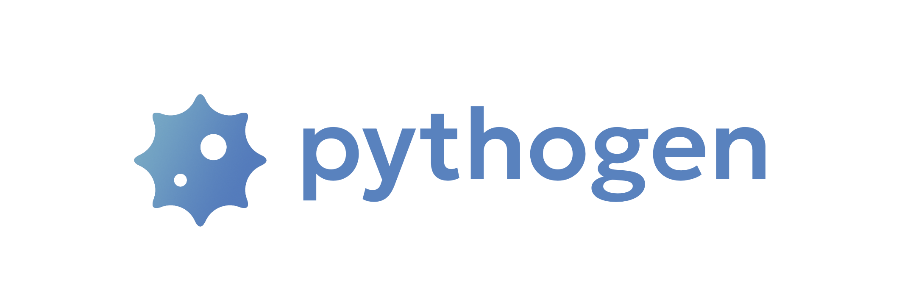

<p align="center">

<br />
Generator of python HTTP-clients from OpenApi specification based on <i>httpx</i> and <i>pydantic</i>
</p>

<p align="center">
<a href="https://github.com/artsmolin/pythogen/actions" target="_blank">
    
</a>
<a href="https://codecov.io/gh/artsmolin/pythogen" target="_blank">
    
</a>
<a href="https://pypi.org/project/pythogen/" target="_blank">
    
</a>
<a href="https://pypi.python.org/pypi/pythogen/" target="_blank">
    
</a>
</p>

---
**Documentation**: <a href="https://artsmolin.github.io/pythogen" target="_blank">https://artsmolin.github.io/pythogen</a>

**Source Code**: <a href="https://github.com/artsmolin/pythogen" target="_blank">https://github.com/artsmolin/pythogen</a>

**Examples**: [sync](/examples/petstore/client_sync.py) and [async](/examples/petstore/client_async.py) clients for [Petstore OpenAPI](/examples/petstore/openapi.yaml)

---

## Installation
You can install the library
```shell
pip install pythogen
```
or use Docker
```shell
docker pull artsmolin/pythogen
```

## Generation
- `path/to/input` — path to the directory with openapi.yaml;
- `path/to/output` — the path to the directory where the generated client will be saved;

Generate a client using the installed library
```shell
pythogen path/to/input/openapi.yaml path/to/output/client.py
```

or via Docker
```shell
docker run \
-v ./path/to/input:/opt/path/to/input \
-v ./path/to/output:/opt/path/to/output \
artsmolin/pythogen \
path/to/input/openapi.yaml \
path/to/output/client.py
```

## Usage
```python
from petstore.client_async import Client
from petstore.client_async import Pet
from petstore.client_async import EmptyBody
from petstore.client_async import FindPetsByStatusQueryParams

client = Client(base_url="http://your.base.url")
pets: list[Pet] | EmptyBody = await client.findPetsByStatus(
  query_params=FindPetsByStatusQueryParams(status="available"),
)
```
