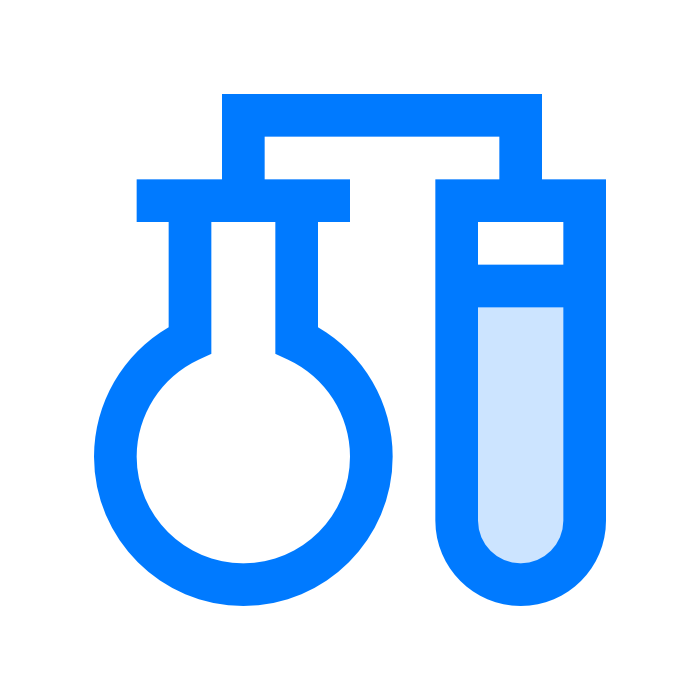
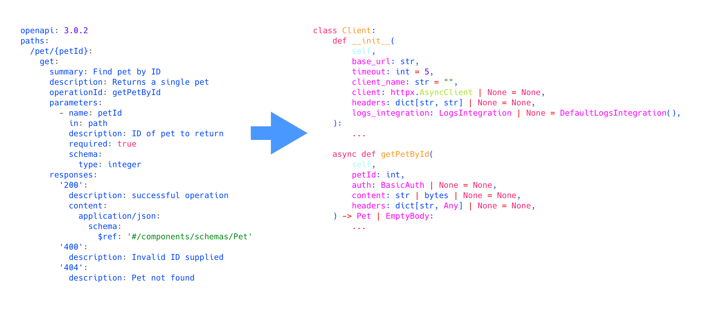

<div>
  <p align="center">
    
  </p>
  <h1 align="center"><strong>Pythogen</strong></h1>
</div>

Generator of python HTTP-clients from OpenApi specification based on `httpx` and `pydantic`.

[](https://github.com/artsmolin/pythogen/actions)
[](https://codecov.io/gh/artsmolin/pythogen)
[](https://pypi.python.org/pypi/pythogen/)
[](https://pypi.org/project/pythogen/)
[](https://github.com/artsmolin/pythogen/blob/master/LICENSE)
[](https://github.com/psf/black)

---

<p align="center">
  
</p>

## Features
- [Discriminator](/docs/discriminator.md)
- [Metrics](/docs/metrics.md)
- Sync/async clients

## Examples
- [**Petstore OpenAPI**](/examples/petstore/openapi.yaml):  [client_sync.py](/examples/petstore/client_sync.py) | [client_async.py](/examples/petstore/client_async.py)

## Installation
```shell
pip install pythogen
```

## Usage
### Generate ordinary clients
- Asynchronous client
  ```shell
  pythogen path/to/input/openapi.yaml path/to/output/client.py
  ```
- Asynchronous client with integration for metrics
  ```shell
  pythogen path/to/input/openapi.yaml path/to/output/client.py --metrics
  ```
- Synchronous client
  ```shell
  pythogen path/to/input/openapi.yaml path/to/output/client.py --sync
  ```
- Synchronous client with integration for metrics
  ```shell
  pythogen path/to/input/openapi.yaml path/to/output/client.py --sync --metrics
  ```
### Generate client as python-package
```shell
pythogen path/to/input/openapi.yaml path/to/package/output --package-version=0.0.1 --package-authors="Rick, Morty"
```
- `--package-version` — required;
- `--package-authors` — optional;
- `path/to/package/output` — path to the directory where package will be saved.
### Usage client
```python
from petstore.client_async import Client
from petstore.client_async import Pet
from petstore.client_async import EmptyBody

client = Client(base_url="http://your.base.url")
pets: list[Pet] | EmptyBody = await client.findPetsByStatus(status="available")
```

## Development
- Activate environment
  ```shell
  rm -rf .venv || true
  python3 -m venv .venv
  source .venv/bin/activate
  make requirements
  ```
- Make changes
- Execute `make clients-for-tests && make test-clients`
- Execute `make clients-for-examples`
